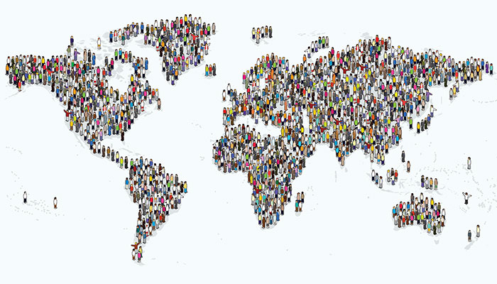

  

<h3 align="center">World Population Analysis</h3>

---

  An analysis of the world's population per country and city 
      

## 📝 Table of Contents

- [Team](#Team)
- [About](#about)
- [Getting Started](#getting_started)
- [Visualizations](#visualizations)
- [Acknowledgements](#acknowledgement)

## 🧐 Team 
•	Rye Capati
•	Steve Milton
•	Cicily George
•	Parastoo Razavi
•	Ezra Tassone

## 🧐 About 
**Description:**
Analysis of the World Population per country and city. 
Data clean-up:
1.	Merging data from various datasets
2.	Check for duplication
3.	Check for invalid value
4.	Made sure the data frame is consistent for all the data set.
5.	Made sure no rows accidentally deleted

**Summary:**
The current US Census Bureau world population estimate in June 2019 shows that the current global population is 7,577,130,400 people on earth, which far exceeds the world population of 7.2 billion from 2015. Our dataset estimate which is based on UN data shows the world's population surpassing 7.7 billion.

Many other nations have populations of at least one million, while there are also countries that have just thousands. The smallest population in the world can be found in Vatican City, where only 801 people reside.

Although the number presented in our project seems very precise, it is important to remember that it is just an estimate. It simply isn't possible to be sure exactly how many people there are on Earth at any one time.
 

## 🏁 Getting Started 

**Questions to Answer:**  
1.	What are the top 10 countries with the largest population?
2.	What is the percentage of the top 10 countries compared to the rest of the world?
3.	What are the top 10 cities with the largest population?
4.  Is the largest populated city located in the largest populated country in the world?
5.	Predicted population from 2020 to 2050 (eg. Australia)?

## ✍️ Visualizations 

* World map with 2020 country population details. 

* Top 10 Countries & Top 10 cities in 2020. 

* Top 10 Countries vs World Population ratio in 2020. 

* Australia population actual & prediction. 

* Australia sex ratio. 

* Australia birth rate. 

* Australia death rate. 

* Countries population actual &prediction. 

* Cities population in 2019 & 2020. 

* API data. 

## 🎉 Acknowledgements 
- UWA Data Science
- Data source (scraped): https://worldpopulationreview.com
- Data source (scraped): https://www.iban.com/country-codes
- Data source (csv download): https://datacatalog.worldbank.org
- Data source (geojson download): https://github.com/johan/world.geo.json/blob/master/countries.geo.json
